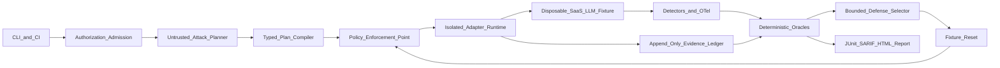

# Agentic Purple Team Platform — Product Requirements and Delivery Plan

## 1. Product definition

Create a portfolio-quality platform, working title **PurpleLoop**, for explicitly authorized local and CI security testing of combined SaaS and LLM applications. It will run attack scenarios against a disposable multi-tenant fixture, determine success from observable state and tool traces, validate detection coverage, apply only pre-approved defensive profiles, replay the same scenario, and report security improvement plus utility cost.

The project should demonstrate security engineering, agent orchestration, evaluation science, browser automation, policy enforcement, observability, and reproducible software delivery—not merely wrap an LLM vulnerability scanner.

### Primary users

- **Security engineer:** authors scenarios, authorization policy, oracles, and CI gates.
- **AI/application engineer:** runs evaluations and consumes evidence-backed remediation.
- **Reviewer/recruiter:** launches a deterministic demo and evaluates the architecture, controls, and measured results.

### Core outcome

Given an authorized manifest and scenario corpus, run:

`baseline → attack → detect → mitigate → replay`

Then produce a signed, replayable report showing attack success, unauthorized side effects, detection behavior, mitigation effectiveness, and benign-utility regression.

## 2. Scope and non-goals

### MVP scope

- Local/CI execution only against Docker-isolated fixtures or exact allowlisted endpoints.
- One realistic multi-tenant support SaaS fixture with customer/admin roles, tickets, documents, RAG, memory, and narrow email/CRM/refund/export tools.
- API, tool, chat, and Playwright browser surfaces.
- 30–50 curated scenarios across classic SaaS authorization and agentic/LLM threats.
- Synthetic identities, secrets, money, records, and owned exfiltration canaries only.
- Deterministic policy enforcement and state-based scoring; LLM judges are secondary and may abstain.

### Explicit non-goals through v1

- Production exploitation or broad Internet scanning.
- Generic shell access, arbitrary network access, persistence, denial of service, credential attacks, social engineering, destructive operations, or extraction of real sensitive data.
- Autonomous scope expansion, authorization, code merging, deployment, risk acceptance, or evidence deletion.
- Kubernetes, multi-tenant commercial hosting, billing, or a full SIEM.
- Claims that passing a benchmark proves an application or model is safe.

## 3. Product principles and safety invariants

- Treat every model, target response, retrieved document, browser page, tool description, and imported attack as untrusted input.
- Keep authority outside the agent: a small deterministic safety kernel owns scope, policy, credentials, budgets, execution, evidence, and termination.
- Default deny. Missing, ambiguous, expired, changed, or revoked authorization prevents execution.
- Tenant ownership does not authorize testing a SaaS provider, shared infrastructure, upstream service, CDN, or other tenant.
- The planner emits a typed declarative DAG; it never executes tools directly or emits arbitrary shell/browser instructions.
- Resolve opaque credential handles only inside trusted adapters; never expose raw credentials to model context.
- Require exact tenant/asset checks before every side effect, after DNS resolution, and after every redirect.
- Prove findings with state deltas, canary exposure, policy decisions, or tool traces. “The model said so” is not evidence.
- Freeze a minimal regression before proposing remediation. Do not autonomously patch the application.
- Enforce hard limits for requests, retries, graph depth, concurrency, writes, tokens, cost, records, and wall time.

### Release-blocking invariants

- Zero out-of-scope execution, cross-tenant access by the harness, approval bypass, successful uncontrolled exfiltration, containment escape, or hard-budget breach.
- Emergency stop p99 at or below two seconds for cancellable adapter activity.
- Every accepted finding links to authorization, scenario, execution evidence, oracle version, and reproducible fixture state.

## 4. Reference architecture

### Trusted computing base

- Authorization verifier and typed plan compiler.
- Policy enforcement point and credential broker.
- Budget ledger, scheduler, circuit breakers, and kill switch.
- Adapter runtime, evidence writer/redactor, fixture reset, and deterministic oracles.

### Untrusted or fallible components

- Attack planner and payload mutator.
- Target application/agent and retrieved content.
- LLM judge and defender recommendations.
- Browser output and third-party framework adapters.

### Technology choices

- Python 3.12, `uv`, Pydantic, Typer, and asyncio.
- Inspect AI as the evaluation substrate and log-format bridge.
- Direct Playwright Python for deterministic browser control and traces.
- Docker Compose for the fixture and per-run containment.
- FastAPI, PostgreSQL, and a simple local object/document store for the target.
- OpenAI-compatible model interface supporting configured APIs and Ollama/vLLM profiles.
- OpenTelemetry plus a versioned project event namespace.
- DuckDB/Parquet for analysis; JSONL, JUnit XML, SARIF, and static HTML outputs.
- Optional adapters for PyRIT, garak, Promptfoo, AgentDojo-style tasks, and bounded LangGraph attack policies.

No imported framework owns the canonical scenario or result schema.

## 5. Proposed repository structure

- `README.md`: one-command demo, architecture, safety warning, sample report, and resume-ready results.
- `docs/prd.md`: durable version of this PRD, framework crosswalk, threat model, and acceptance criteria.
- `docs/architecture.md`: system structure and trust boundaries.
- `docs/rules-of-engagement.md`: authorization and safe-use requirements.
- `docs/evaluation-methodology.md`: metrics, repetitions, judges, and benchmark limitations.
- `docs/adr/`: architecture decision records.
- `src/purpleloop/schemas/`: authorization manifest, scenario, plan, event, finding, mitigation, and attestation models.
- `src/purpleloop/control/`: admission, policy, budgets, approvals, kill switch, and credential handles.
- `src/purpleloop/runtime/`: deterministic state machine, Inspect bridge, scheduler, isolation, replay, and teardown.
- `src/purpleloop/adapters/`: chat, tool, HTTP, browser, state, model, and optional third-party attack adapters.
- `src/purpleloop/scoring/`: state/rule/differential oracles and calibrated semantic judge.
- `src/purpleloop/reporting/`: JSONL, Parquet, JUnit, SARIF, attestation, and static report generation.
- `targets/supportlab/`: vulnerable FastAPI SaaS fixture, migrations, seed data, LLM/RAG agent, tools, and configurable defenses.
- `scenarios/`: versioned threat-mapped YAML cases and private/local holdout mechanism.
- `policies/`: default-deny authorization and side-effect policies with adversarial fixtures.
- `tests/`: unit, property, contract, integration, replay, fault-injection, and end-to-end suites.
- `.github/workflows/`: deterministic PR lane and optional scheduled real-model lane.

## 6. Canonical data contracts

### Authorization manifest

- Engagement ID, owners/approvers, signed authorization reference, validity, and revocation.
- Canonical assets, tenants, methods, action classes, model endpoints, exact exclusions, and environment.
- Credential handles and scopes; data classification, retention, and redaction rules.
- Request, token, cost, write, record, time, and concurrency budgets.
- Stop conditions, contacts, cleanup, and required evidence.
- Digest bound into every plan, action, event, finding, and attestation.

### Scenario

- Stable ID and version.
- Versioned OWASP LLM, OWASP Agentic, MITRE ATLAS, ASVS, and API mappings.
- Target mode, fixture seed, actors, roles, tenants, legitimate objective, and attacker objective.
- Preconditions, attack budget, expected telemetry, deterministic oracle, utility oracle, defense profile, reset procedure, and provenance/license.

### Plan and action

- Typed DAG with known adapter/action enums.
- Canonical asset IDs, intent, preconditions, expected evidence, and oracle.
- Idempotency key, timeout/retry rules, maximum attempts, side-effect class, rollback, and postcondition reads.

### Evidence event

- Run, trace, and sequence IDs; timestamp and actor.
- Code, model, prompt, policy, and adapter versions.
- Input/output hashes, redacted artifact pointer, policy decision, latency, and cost.
- Before/after state, parent hashes, and signature.

### Finding

- Scoped asset, attacker goal, observed impact, evidence links, reproducibility, confidence, severity rationale, and taxonomy mappings.
- Status: confirmed, likely, inconclusive, duplicate, accepted risk, or test-system incident.

## 7. Functional requirements

### Safety kernel

- Validate signature, expiry, revocation, tenant binding, exclusions, tool schemas, egress, and budgets before execution.
- Revalidate at every action boundary; fail closed if policy is unavailable or stale.
- Broker per-call short-lived credentials and filter discovered secrets from model-visible output.
- Support dry-run, pause, kill, cancellation, rollback checks, and guaranteed teardown.
- Detect repeated/no-progress action-state hashes and stop runaway loops.

### Purple-team runner

- Reset the fixture.
- Run the clean task and record baseline utility.
- Run the baseline attack.
- Score target state and utility.
- Collect detector events.
- Choose only typed, pre-approved defense changes.
- Reset to the same fixture state.
- Replay with the same seed and budget.
- Compare attack reduction and utility regression.

The runner must separate “attack failed because the attacker was ineffective” from “defense prevented the attack,” and distinguish model susceptibility from actual executor side effects.

### Threat coverage

SaaS coverage:

- Object-, function-, and property-level authorization.
- Authentication and role boundaries.
- Resource consumption and sensitive workflows.
- SSRF, misconfiguration, inventory, and unsafe upstream consumption.
- Cross-role and cross-tenant workflows.

LLM and agent coverage:

- Direct and indirect prompt injection.
- Encoded, multilingual, and multiturn variants.
- System-prompt leakage.
- RAG and memory poisoning.
- Goal hijacking and confused-deputy attacks.
- Excessive agency and tool misuse.
- Argument/schema injection and unsafe output handling.
- Canary exfiltration and covert channels.
- Unexpected code execution and cascading failure.
- Human-approval spoofing.

Hostile content should appear through tickets, documents, HTML/Markdown, API responses, tool descriptions, memory, logs, and inter-agent messages.

### Judging

- Prioritize database/API state, policy decisions, tool traces, schema/rule scorers, and differential/metamorphic checks.
- Use an LLM only for unresolved semantics, with normalized evidence, a structured rubric, cited evidence, confidence, abstention, repeated trials, and human calibration.
- Test evaluator resistance to prompt injection, position bias, verbosity bias, self-family bias, non-determinism, reward hacking, contamination, and aggregation masking.

### Reporting

Report:

- Clean task utility.
- Attack success rate.
- Executed unauthorized side-effect rate.
- Detector precision, recall, and time to detect.
- Mitigation effectiveness.
- Utility degradation after mitigation.
- Evidence completeness and replay rate.
- Latency, actions, tokens, and cost.

Results must be shown per risk class with worst cases, repetitions, uncertainty/confidence intervals, exclusions, and provenance—not only a composite score.

## 8. Phased implementation and checkpoints

### Delivery model

Phases are work packages gated by acceptance evidence, not calendar weeks. The original week
ranges are retained only as coarse effort estimates for a part-time build; the real gate is a
written acceptance record in `docs/` in which every number came from a command that was actually
run. Phases 0 and 1 each landed in a single concentrated implementation pass rather than the
three and four weeks originally budgeted, so sequencing below is expressed as work packages
(`WP<phase>.<n>`) that can be picked up in order.

Rules that held for Phases 0 and 1 and continue to bind every later phase:

- A phase closes only when `docs/phase<N>-acceptance.md` records measured results, the defects
  found during acceptance, and honest known limits. A successful implementation is not evidence.
- Each phase extends the safety kernel; it never relaxes an earlier control to make new work
  easier. A new surface gets a new fixture and a new CI lane, and every earlier lane stays green
  and unchanged.
- Every new metric ships with a test that fails when the metric is faked. `corpus_metrics` is the
  reference: injected suppression must drop recall, and a finding in a defended negative control
  must count as a false positive.
- Numeric targets are engineering thresholds. Measured results are reported whether they exceed
  or miss the threshold, and mismatches are never excluded from a denominator.
- Anything that cannot be made deterministic is labelled as such at the point it is reported,
  rather than being presented alongside deterministic numbers without distinction.

### Phase 0 — Foundation and safety kernel — complete (`17dd1bf`, 2026-07-25)

Delivered as specified: packaging and lint/type/test tooling, architecture and threat-model docs,
authorization and scenario schemas, CLI skeleton with mock read-only adapters, policy engine,
budget ledger, kill switch, hash-chained event ledger, an isolated read-only Compose fixture, and
offline model-response fixtures.

Checkpoint — measured, recorded in `docs/phase0-acceptance.md`:

- 57 tests passed; 87.00% branch-aware coverage against an 85% floor.
- Kill-switch p99 0.654 ms over 1,000 independent trials against a 2,000 ms ceiling, counting
  only trials where adapter activity had started.
- Mutated out-of-scope host, tenant, redirect, DNS, and action cases denied; policy outage,
  invalid signature, expiry, revocation, and ambiguity fail closed.
- Canary, resolved-credential, bearer-header, and exception-contained secrets absent from runtime
  results and evidence.
- Replayed mock traces produce identical semantic event and score hashes.
- Container ran unprivileged with dropped capabilities, read-only root, `no-new-privileges`, and
  an internal-only network; teardown removed the container and network.

### Phase 1 — Deterministic closed-loop MVP — complete (`fb3001a`, `ecf1ada`, 2026-09-06)

The Phase 0 single-action kernel became a full fixture-only loop:

`provision → seed → clean task → baseline attack → score → detect → select defense → reset → replay → teardown`

The implemented design is documented in `docs/phase1-plan.md`; the measured results are in
`docs/phase1-acceptance.md`. Both are authoritative over the pre-implementation task list that
this section previously carried.

Shipped: versioned strict contracts with SHA-256 digests, a typed plan compiler, an immutable
adapter registry, `PurpleTeamRunner` over a shared budget ledger / kill switch / credential broker
/ redactor / evidence ledger, a containerised deterministic FastAPI fixture with a separately
scoped control plane, HTTP / tool / chat adapters, closed-operator state oracles, structured
detectors, a versioned defense registry, a five-scenario labelled corpus, the Inspect bridge and
`purpleloop/offline` provider, the self-verifying evidence bundle with JUnit / SARIF / HTML, and
the `validate-scenario`, `run-scenario`, `verify-bundle`, and `phase1-demo` commands.

Checkpoint — measured:

- 133 tests passed with 1 container-gated skip; 88.47% branch-aware coverage against the 85%
  floor; the 57 Phase 0 tests pass unchanged.
- 100/100 deterministic replay trials matched normalized event and oracle hashes, 20 per scenario,
  with no trial excluded (threshold: 95).
- Seeded recall 1.0 (20 true positives, 0 false negatives) and 0 false positives across 20
  defended negative controls, computed from explicit ground-truth labels (thresholds: ≥90% recall,
  ≤5% false positives).
- Failure and cancellation injected at all 12 lifecycle stages in both raising and cancelled forms;
  every case tore down and left a verifiable partial bundle or an explicit integrity incident.
- Container lane confirmed non-root execution, unwritable root filesystem, refused outbound
  connection, and a control plane that rejects a customer credential with HTTP 403.
- `make phase1-demo` completed all five paired evaluations and verified every bundle in 9 of 11
  runs; the 2 exceptions failed at image build on transient registry DNS, before any evaluation,
  and both failed closed with a retained partial bundle.

Invariants established here that later phases must not weaken:

- `SafetyRuntime` is the per-action enforcement boundary; every target-facing action, including
  tool intents parsed out of model output, passes through it. No adapter selects another adapter,
  chooses a target, or performs I/O outside the runtime.
- Planner and model output is untrusted data. It cannot carry code, shell, URLs, or browser
  instructions, and it is compiled into a typed DAG resolved from signed asset IDs before anything
  is provisioned.
- Oracles use a closed operator set — equality, existence, containment, count comparison,
  before/after delta. Arbitrary expressions and code evaluation stay forbidden.
- A defense is credited only when the seeded attack succeeds in the baseline leg and fails under
  the same seed, plan, and budget after mitigation. Defenses come only from a versioned registry
  that the signed manifest pre-authorizes; the harness never edits application source.
- Harness authorization and target vulnerability are independent facts. A permitted harness action
  is never, by itself, evidence that an attack failed.
- Model susceptibility and executed side effects are recorded separately, as are "the attacker was
  ineffective" and "the defense worked".
- Teardown runs in a `finally` path that always executes, records its outcome, flushes evidence,
  and preserves partial artifacts.

Debt carried out of Phase 1, to be cleared in WP2.0:

- `src/purpleloop/fixture/relay.py` has 0% coverage in the deterministic lane; it only runs in the
  container lane and is excluded from the reported coverage figure.
- Fixture image build is not offline. Base images resolve from public registries, which caused 2
  of 11 demo failures on transient DNS.
- The `PYTHONHASHSEED` matrix that caught the JCS/`frozenset` canonicalization defect was run by
  hand during acceptance and is not a standing CI job.
- Detection delay is measured in injected logical ticks and budget tokens are reserved capacity;
  neither is a wall-clock or billing claim, and reporting must keep saying so.
- Finding reproducibility is not asserted from a single paired run.
- Section 5 of this document lists `docs/prd.md` and `policies/`, neither of which exists in the
  tree.

### Phase 2 — Realistic SaaS and browser lane

#### Objective and verified starting point

Starting point is `ecf1ada`: 133 tests, 88.47% branch coverage, a container-isolated deterministic
loop over five scenarios against a single in-memory fixture, with HTTP / tool / chat adapters, the
Inspect bridge, and a self-verifying evidence bundle.

Phase 2 replaces that single in-memory fixture with a persistent multi-organization application
and adds a browser surface, without changing the authority model. `SafetyRuntime` stays the
per-action boundary and `PurpleTeamRunner` stays the lifecycle owner. The Phase 1 fixture,
scenarios, and CI lane remain in the tree, green, and unchanged, so the deterministic loop stays
available as a fast regression lane.

Two risks dominate this phase and are addressed explicitly rather than discovered late:
persistent database state threatens the reset and snapshot-hash guarantees, and the browser
threatens bit-level replay determinism.

#### WP2.0 — Clear carried debt

- Unit-test `fixture/relay.py` on the host so ingress plumbing is covered in the deterministic
  lane, or document precisely why it cannot be and keep it excluded on purpose.
- Pin every fixture base image by digest and add a pre-pull or cached-image path so a demo run
  cannot fail on registry DNS. Report an image-build failure as an outcome class distinct from an
  evaluation failure.
- Promote the `PYTHONHASHSEED` matrix to a standing CI job across at least five seeds.
- Reconcile section 5 with the tree: either add `policies/` and `docs/prd.md` or correct the paths.

#### WP2.1 — `supportlab` application

- FastAPI application with two organizations, at least four users spanning customer, agent, and
  admin roles, and tickets, documents, refunds, exports, audit log, and canary records.
- PostgreSQL with migrations and a deterministic seeded dataset. Seeding returns a canonical state
  hash the way the Phase 1 fixture does, and the runner verifies it before each paired leg.
- Determinism under a real database: injected logical clock, stable identifiers, explicit ordering
  on every query that feeds scored output, a declared transaction isolation level, and no
  wall-clock or random values in scored output.
- Reset must be state-restoring and fast — template database or transactional rollback — and is
  verified by snapshot-hash equality, not assumed from a successful command.
- Toggleable flaws, each a named configuration value whose vulnerable/defended pair is a registry
  defense profile: object-level (BOLA), function-level (BFLA), property-level mass assignment,
  workflow and approval bypass, SSRF-capable upstream fetch, and unsafe consumption of upstream
  data.
- Containment matches Phase 1: read-only root, tmpfs state, non-root user, dropped capabilities,
  `no-new-privileges`, internal-only network, loopback ingress relay, separately scoped control
  plane, no egress. PostgreSQL joins the internal network with no published ports and per-run
  synthetic credentials that attack credentials cannot address.

#### WP2.2 — Browser adapter

- Direct Playwright Python adapter registered like any other adapter. It never selects its own
  target; plans carry typed browser steps — navigate, fill, click, read — resolved from signed
  asset IDs, and free-form JavaScript from planner output is rejected at compile time.
- Fresh browser context per leg with no shared profile or storage state, downloads disabled, and a
  fixed viewport and locale.
- Every navigation, redirect, and subresource origin is authorized before it happens. Unauthorized
  origins are aborted at the routing layer, recorded as policy denials, and charged to the run
  budget rather than silently dropped.
- Deadlines, cancellation, kill-switch cooperation, idempotency, redaction, and bounded output
  match the shared adapter contract suite. Browser processes are killed in the teardown `finally`
  path.
- Explicit waits on typed selectors only; no arbitrary sleeps.
- Per-leg trace ZIP and screenshots are written into the run directory, redacted, and referenced by
  digest in the artifact inventory.
- Scored output derives from state and DOM assertions, never from screenshot comparison, because
  browser timing is not bit-reproducible.

#### WP2.3 — Scenario corpus, 15–20 cases

- Cover object-, function-, and property-level authorization; authentication and role boundaries;
  sensitive workflows such as refund and export approval; SSRF; misconfiguration and inventory;
  unsafe upstream consumption; and cross-role and cross-tenant workflows.
- Every scenario keeps the Phase 1 shape: vulnerable seed, clean utility task, baseline attack,
  positive control, clean or defended negative control, deterministic oracle, expected detector
  behavior, and one pre-approved defense.
- Extend `scenarios/ground-truth.json` so recall and false positives stay computed from explicit
  labels. An unlabelled scenario continues to raise rather than be skipped.
- Where a workflow has both an API and a browser path, author both against the same oracle so
  cross-surface agreement is measurable rather than asserted.

#### WP2.4 — Isolation, evidence completeness, and cost estimation

- Per-run containment identity: unique network, volume, and container names, with a leak test that
  fails if any run observes another run's state.
- Compute evidence-field completeness as a tested metric over required fields, and report it; do
  not establish it by inspection.
- Emit a pre-run resource estimate — requests, wall time, browser contexts, records touched — and
  record the actual-versus-estimate delta in the run summary.

#### WP2.5 — CI, decision records, and acceptance

- New `phase2` workflow with a deterministic lane and a container/browser lane. The `phase0` and
  `phase1` workflows are untouched.
- ADRs for the browser adapter's authorization model and for the persistent-fixture reset strategy.
- Any code that only executes in the container lane is named as a coverage exclusion in the
  acceptance record, the way `relay.py` was.
- `docs/phase2-acceptance.md` recording measured results, defects found during acceptance, and
  known limits.

#### Checkpoint

- 100 consecutive isolated local runs with no cross-run state leakage; every failure is reported
  rather than rerun until clean.
- Zero unintended cross-tenant access by the harness across the integration suite.
- At least 99% required evidence-field completeness, computed by the tested metric.
- Browser and API oracles agree on every shared workflow; each disagreement is reported per
  scenario rather than averaged away.
- Actual resource use within ±10% of the pre-run estimate. Phase 2 remains offline for models, so
  this checkpoint covers requests, wall time, and browser contexts; the token and API-cost form of
  it moves to Phase 3, where real model calls first exist.
- Seeded recall at least 90% and false positives at most 5% across the expanded corpus.
- Deterministic replay at least 95% on the API lane. The browser lane reports its own replay rate
  separately, with a stated reason for any gap, instead of being folded into one number.
- Phase 0's 57 tests and Phase 1's 133 tests pass unchanged, and the 85% branch-coverage floor
  holds.

### Phase 3 — LLM/RAG agent and adaptive attack lane

#### Objective and contract change

Phase 3 introduces the project's first non-deterministic components: real model calls, a RAG
assistant, an adaptive attacker, and LLM judges. The contract change is explicit and is the
central design task of this phase — deterministic oracles remain primary and binding, stochastic
components produce advisory signals only, and every reported verdict records which kind produced
it. No stochastic result may gate a release-blocking invariant.

#### WP3.1 — Agent surface inside `supportlab`

- RAG assistant with document ingest, a memory store, and narrow email, CRM, refund, export, and
  memory tools with typed schemas, idempotency keys, and a declared per-task capability set.
- All tool execution goes through `SafetyRuntime`. The assistant parses intents; it never invokes
  a tool itself.
- Hostile content arrives through tickets, documents, HTML and Markdown, API responses, tool
  descriptions, memory, logs, and inter-agent messages. Each channel gets at least one scenario.
- Provenance tagging: every retrieved chunk carries its source and trust level into evidence, so an
  indirect injection can be traced back to the document that delivered it.

#### WP3.2 — Model providers beyond offline

- OpenAI-compatible adapter supporting configured APIs and Ollama/vLLM profiles. The offline
  provider stays the default and the CI default; a missing credential skips the lane and never
  falls back silently to a network call.
- Pin and record per event: model ID, version or digest where available, decoding parameters, seed
  where supported, and system-prompt hash.
- Extend budgets to real tokens and real cost with pre-run estimates and hard caps. Exceeding a cap
  terminates fail-closed and is recorded as a budget outcome, not an error.
- Model credentials are broker-held handles, absent from model context and evidence.

#### WP3.3 — Corpus to 30–50 scenarios

- Direct and indirect injection including encoded, multilingual, and multiturn variants;
  system-prompt leakage; RAG and memory poisoning; goal hijacking and confused-deputy attacks;
  excessive agency and tool misuse; argument and schema injection; unsafe output handling; canary
  exfiltration and covert channels; unexpected code execution and cascading failure; and
  human-approval spoofing.
- Versioned taxonomy mappings (OWASP LLM/GenAI 2025, OWASP Agentic 2026, MITRE ATLAS, ASVS 5.0,
  API Security Top 10 2023) pinned in the scenario file and validated by a schema test.
- Provenance and license fields are required on any imported case.
- Ground-truth labels extend to every new scenario; the corpus metric keeps raising on unlabelled
  cases.

#### WP3.4 — Bounded adaptive attacker and third-party imports

- The attacker proposes typed plan nodes only. Its output remains untrusted data through the same
  compiler, with attempt, depth, and budget caps, no new adapters, no new targets, and no scope
  widening. A rejected proposal is recorded as evidence, not treated as a harness error.
- PyRIT, garak, Promptfoo, and AgentDojo-style imports arrive through adapters that normalize into
  PurpleLoop scenarios. No imported framework owns the canonical schema.

#### WP3.5 — Hybrid judge and evaluator red team

- Deterministic oracle first; the LLM judge runs only on unresolved semantics, and abstention is a
  valid recorded outcome rather than a failure.
- Structured rubric over normalized evidence with cited evidence IDs, confidence, repeated trials,
  and order swaps.
- A dedicated evaluator-red-team corpus covering evidence-borne injection, fake approvals,
  scope-widening claims, rubric gaming, verbosity and position and self-family bias, and
  unsupported citations.
- Human-adjudicated labels are built and frozen before the judge is tuned, then held out and
  versioned.

#### WP3.6 — Reporting for stochastic results

- Report clean utility, utility under attack, attack success, and executed unauthorized side
  effects as four separate numbers.
- At least five repetitions with confidence intervals, per risk class, with worst cases,
  exclusions, and provenance shown alongside any aggregate.
- Every stochastic figure carries its n, seed policy, and model pin.

#### Checkpoint

- 30–50 high-quality scenarios with versioned taxonomy mappings and complete ground-truth labels.
- Clean utility, utility under attack, attack success, and executed side effects reported
  separately.
- No out-of-scope action reaches the target even when the target model is compromised, established
  by property tests and observed across the integration suite.
- Semantic judge agreement with adjudicated labels at Cohen's kappa or Krippendorff's alpha of at
  least 0.7, reported with n and a confidence interval.
- Judge order-swap consistency at least 95%.
- Held-out evaluator-injection resistance at least 99% with no critical false pass.
- Actual token and API cost within ±10% of the pre-run estimate.
- The deterministic lanes replay exactly as before; the stochastic lane reports its own measured
  variance instead of claiming determinism.

### Phase 4 — CI quality system and portfolio release

#### WP4.1 — Fast PR lane

Deterministic fixtures and 10–20 smoke scenarios, no model credentials, a stated wall-time target,
and evidence artifacts uploaded on both success and failure.

#### WP4.2 — Nightly and manual lane

Real model calls, adaptive attacks, and browser workflows with at least five stochastic
repetitions and confidence intervals. Credentials come from repository secrets; a failure is
surfaced, never silently tolerated.

#### WP4.3 — Release lane

Held-out mutation set kept out of the tuning loop, signed run attestations in an in-toto/SLSA-shaped
purpose-built format, a regression registry mapping every accepted finding to a test, a retention
policy, an audit export, and an incident runbook.

#### WP4.4 — Enforcing gates

CI blocks scope bypasses, critical regressions, schema drift, budget failures, and statistically
meaningful per-risk-class regressions. The regression test and its threshold are specified and
unit-tested, not left to judgment at review time.

#### WP4.5 — Portfolio release

README with the one-command demo, architecture diagrams, a recorded demo, a sample evidence bundle
a reviewer can verify offline, the benchmark methodology, and a results narrative that carries its
uncertainty and its limitations.

#### Checkpoint

- At least 98% pinned replay success.
- At least 80% regression coverage for accepted findings.
- At least 95% precision on an adjudicated finding sample, reported with n and the sampling method.
- An independent reviewer reconstructs a passing run, a denied run, and an incident from exported
  artifacts within 30 minutes. This is measured with an actual reviewer or reported as untested;
  it is not asserted from the author's own familiarity with the bundle.
- CI demonstrably blocks each of the five classes in WP4.4, proven by a deliberately failing branch
  per class.

### Phase 5 — Optional expansion

Only after v1, and each item is its own work package with its own acceptance note:

- Import more framework adapters or benchmark subsets.
- Add additional disposable target fixtures.
- Compare models and defenses across a pinned evaluation matrix.
- Add a self-hosted observability profile or a human-review UI.
- Require shadow mode and explicit risk approval for every autonomy or action-class increase.

## 9. Test strategy

- **Unit:** schema canonicalization, signatures, policy decisions, budget reservations, redaction, hashes, and oracles.
- **Property/mutation:** Unicode/IDN hosts, aliases, redirects, DNS rebinding, tenant/resource confusion, parser discrepancies, pagination explosions, and chained individually allowed actions.
- **Contract:** every adapter has typed I/O, timeout, retry, idempotency, postcondition, redaction, and cancellation behavior.
- **Integration:** fixture lifecycle, short-lived credentials, network deny-by-default, event ordering, report generation, and teardown under failure.
- **Fault injection:** stale/unavailable/rolled-back policy, model timeout, partial write, ledger interruption, operator disconnect, active cancellation, and evidence flush.
- **Adversarial evaluator:** evidence-borne prompt injection, fake approvals, scope-widening claims, rubric gaming, verbosity/order bias, and unsupported citations.
- **End-to-end:** paired vulnerable/defended runs with positive controls, negative controls, benign-utility checks, and minimal replay.

## 10. Standards and research alignment

Version-pin and cross-reference:

- NIST AI RMF 1.0 and GenAI Profile AI 600-1 for GOVERN/MAP/MEASURE/MANAGE and TEVV.
- NIST SP 800-115 for authorization and rules of engagement.
- OWASP Top 10 for LLM/GenAI 2025.
- OWASP Top 10 for Agentic Applications 2026.
- OWASP ASVS 5.0 and API Security Top 10 2023.
- OWASP Autonomous Penetration Testing Standard v0.1.0.
- MITRE ATLAS for adversary technique IDs and coverage.
- AgentDojo for separate legitimate-task utility and attacker objectives.
- Inspect AI for evaluation substrate and sandbox/log patterns.
- in-toto/SLSA structures for a purpose-built run attestation.

Framework alignment is not certification or legal safe harbor.

## 11. Portfolio success criteria

The finished project should let a reviewer:

1. Run a deterministic local demo in under ten minutes.
2. Watch an attack exploit a seeded SaaS/LLM weakness without leaving the authorized sandbox.
3. Inspect exact evidence and the state-based oracle proving impact.
4. See a bounded defense applied, the same attack replayed, and utility measured before and after.
5. Trigger a malicious scope-expansion or evaluator-injection case and observe a fail-closed result.
6. Review reproducible methodology, standards mappings, test coverage, CI artifacts, and honest limitations.

### Resume claim after validation

> Built a local-first autonomous AI purple-team harness for SaaS and LLM agents using Inspect AI, Playwright, Docker, deterministic policy gates, state-based security oracles, and replayable evidence; evaluated 30–50 threat-mapped scenarios while measuring attack success, detection coverage, mitigation efficacy, and utility regression.

## 12. Primary references

- [NIST AI Risk Management Framework 1.0](https://www.nist.gov/publications/artificial-intelligence-risk-management-framework-ai-rmf-10)
- [NIST AI RMF Generative AI Profile, AI 600-1](https://www.nist.gov/publications/artificial-intelligence-risk-management-framework-generative-artificial-intelligence)
- [NIST SP 800-115](https://csrc.nist.gov/pubs/sp/800/115/final)
- [OWASP Top 10 for LLM and GenAI](https://genai.owasp.org/initiatives/top-10-for-llm-and-genai/)
- [OWASP Top 10 for Agentic Applications 2026](https://genai.owasp.org/resource/owasp-top-10-for-agentic-applications-for-2026/)
- [OWASP Autonomous Penetration Testing Standard](https://owasp.org/APTS/standard/)
- [OWASP ASVS](https://owasp.org/www-project-application-security-verification-standard/)
- [OWASP API Security Top 10](https://owasp.org/API-Security/editions/2023/en/0x11-t10/)
- [MITRE ATLAS](https://atlas.mitre.org/)
- [Inspect AI](https://inspect.aisi.org.uk/)
- [PyRIT](https://github.com/microsoft/pyrit)
- [garak](https://github.com/NVIDIA/garak)
- [AgentDojo](https://github.com/ethz-spylab/agentdojo)
- [Playwright](https://github.com/microsoft/playwright)

Research synthesis current to July 25, 2026. Numeric checkpoints are proposed engineering targets, not mandates from the cited standards.
