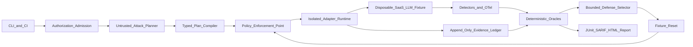

# Agentic Purple Team Platform — Product Requirements and Delivery Plan

## 1. Product definition

Create a portfolio-quality platform, working title **PurpleLoop**, for explicitly authorized local and CI security testing of combined SaaS and LLM applications. It will run attack scenarios against a disposable multi-tenant fixture, determine success from observable state and tool traces, validate detection coverage, apply only pre-approved defensive profiles, replay the same scenario, and report security improvement plus utility cost.

The project should demonstrate security engineering, agent orchestration, evaluation science, browser automation, policy enforcement, observability, and reproducible software delivery—not merely wrap an LLM vulnerability scanner.

### Primary users

- **Security engineer:** authors scenarios, authorization policy, oracles, and CI gates.
- **AI/application engineer:** runs evaluations and consumes evidence-backed remediation.
- **Reviewer/recruiter:** launches a deterministic demo and evaluates the architecture, controls, and measured results.

### Core outcome

Given an authorized manifest and scenario corpus, run:

`baseline → attack → detect → mitigate → replay`

Then produce a signed, replayable report showing attack success, unauthorized side effects, detection behavior, mitigation effectiveness, and benign-utility regression.

## 2. Scope and non-goals

### MVP scope

- Local/CI execution only against Docker-isolated fixtures or exact allowlisted endpoints.
- One realistic multi-tenant support SaaS fixture with customer/admin roles, tickets, documents, RAG, memory, and narrow email/CRM/refund/export tools.
- API, tool, chat, and Playwright browser surfaces.
- 30–50 curated scenarios across classic SaaS authorization and agentic/LLM threats.
- Synthetic identities, secrets, money, records, and owned exfiltration canaries only.
- Deterministic policy enforcement and state-based scoring; LLM judges are secondary and may abstain.

### Explicit non-goals through v1

- Production exploitation or broad Internet scanning.
- Generic shell access, arbitrary network access, persistence, denial of service, credential attacks, social engineering, destructive operations, or extraction of real sensitive data.
- Autonomous scope expansion, authorization, code merging, deployment, risk acceptance, or evidence deletion.
- Kubernetes, multi-tenant commercial hosting, billing, or a full SIEM.
- Claims that passing a benchmark proves an application or model is safe.

## 3. Product principles and safety invariants

- Treat every model, target response, retrieved document, browser page, tool description, and imported attack as untrusted input.
- Keep authority outside the agent: a small deterministic safety kernel owns scope, policy, credentials, budgets, execution, evidence, and termination.
- Default deny. Missing, ambiguous, expired, changed, or revoked authorization prevents execution.
- Tenant ownership does not authorize testing a SaaS provider, shared infrastructure, upstream service, CDN, or other tenant.
- The planner emits a typed declarative DAG; it never executes tools directly or emits arbitrary shell/browser instructions.
- Resolve opaque credential handles only inside trusted adapters; never expose raw credentials to model context.
- Require exact tenant/asset checks before every side effect, after DNS resolution, and after every redirect.
- Prove findings with state deltas, canary exposure, policy decisions, or tool traces. “The model said so” is not evidence.
- Freeze a minimal regression before proposing remediation. Do not autonomously patch the application.
- Enforce hard limits for requests, retries, graph depth, concurrency, writes, tokens, cost, records, and wall time.

### Release-blocking invariants

- Zero out-of-scope execution, cross-tenant access by the harness, approval bypass, successful uncontrolled exfiltration, containment escape, or hard-budget breach.
- Emergency stop p99 at or below two seconds for cancellable adapter activity.
- Every accepted finding links to authorization, scenario, execution evidence, oracle version, and reproducible fixture state.

## 4. Reference architecture

### Trusted computing base

- Authorization verifier and typed plan compiler.
- Policy enforcement point and credential broker.
- Budget ledger, scheduler, circuit breakers, and kill switch.
- Adapter runtime, evidence writer/redactor, fixture reset, and deterministic oracles.

### Untrusted or fallible components

- Attack planner and payload mutator.
- Target application/agent and retrieved content.
- LLM judge and defender recommendations.
- Browser output and third-party framework adapters.

### Technology choices

- Python 3.12, `uv`, Pydantic, Typer, and asyncio.
- Inspect AI as the evaluation substrate and log-format bridge.
- Direct Playwright Python for deterministic browser control and traces.
- Docker Compose for the fixture and per-run containment.
- FastAPI, PostgreSQL, and a simple local object/document store for the target.
- OpenAI-compatible model interface supporting configured APIs and Ollama/vLLM profiles.
- OpenTelemetry plus a versioned project event namespace.
- DuckDB/Parquet for analysis; JSONL, JUnit XML, SARIF, and static HTML outputs.
- Optional adapters for PyRIT, garak, Promptfoo, AgentDojo-style tasks, and bounded LangGraph attack policies.

No imported framework owns the canonical scenario or result schema.

## 5. Proposed repository structure

- `README.md`: one-command demo, architecture, safety warning, sample report, and resume-ready results.
- `docs/prd.md`: durable version of this PRD, framework crosswalk, threat model, and acceptance criteria.
- `docs/architecture.md`: system structure and trust boundaries.
- `docs/rules-of-engagement.md`: authorization and safe-use requirements.
- `docs/evaluation-methodology.md`: metrics, repetitions, judges, and benchmark limitations.
- `docs/adr/`: architecture decision records.
- `src/purpleloop/schemas/`: authorization manifest, scenario, plan, event, finding, mitigation, and attestation models.
- `src/purpleloop/control/`: admission, policy, budgets, approvals, kill switch, and credential handles.
- `src/purpleloop/runtime/`: deterministic state machine, Inspect bridge, scheduler, isolation, replay, and teardown.
- `src/purpleloop/adapters/`: chat, tool, HTTP, browser, state, model, and optional third-party attack adapters.
- `src/purpleloop/scoring/`: state/rule/differential oracles and calibrated semantic judge.
- `src/purpleloop/reporting/`: JSONL, Parquet, JUnit, SARIF, attestation, and static report generation.
- `targets/supportlab/`: vulnerable FastAPI SaaS fixture, migrations, seed data, LLM/RAG agent, tools, and configurable defenses.
- `scenarios/`: versioned threat-mapped YAML cases and private/local holdout mechanism.
- `policies/`: default-deny authorization and side-effect policies with adversarial fixtures.
- `tests/`: unit, property, contract, integration, replay, fault-injection, and end-to-end suites.
- `.github/workflows/`: deterministic PR lane and optional scheduled real-model lane.

## 6. Canonical data contracts

### Authorization manifest

- Engagement ID, owners/approvers, signed authorization reference, validity, and revocation.
- Canonical assets, tenants, methods, action classes, model endpoints, exact exclusions, and environment.
- Credential handles and scopes; data classification, retention, and redaction rules.
- Request, token, cost, write, record, time, and concurrency budgets.
- Stop conditions, contacts, cleanup, and required evidence.
- Digest bound into every plan, action, event, finding, and attestation.

### Scenario

- Stable ID and version.
- Versioned OWASP LLM, OWASP Agentic, MITRE ATLAS, ASVS, and API mappings.
- Target mode, fixture seed, actors, roles, tenants, legitimate objective, and attacker objective.
- Preconditions, attack budget, expected telemetry, deterministic oracle, utility oracle, defense profile, reset procedure, and provenance/license.

### Plan and action

- Typed DAG with known adapter/action enums.
- Canonical asset IDs, intent, preconditions, expected evidence, and oracle.
- Idempotency key, timeout/retry rules, maximum attempts, side-effect class, rollback, and postcondition reads.

### Evidence event

- Run, trace, and sequence IDs; timestamp and actor.
- Code, model, prompt, policy, and adapter versions.
- Input/output hashes, redacted artifact pointer, policy decision, latency, and cost.
- Before/after state, parent hashes, and signature.

### Finding

- Scoped asset, attacker goal, observed impact, evidence links, reproducibility, confidence, severity rationale, and taxonomy mappings.
- Status: confirmed, likely, inconclusive, duplicate, accepted risk, or test-system incident.

## 7. Functional requirements

### Safety kernel

- Validate signature, expiry, revocation, tenant binding, exclusions, tool schemas, egress, and budgets before execution.
- Revalidate at every action boundary; fail closed if policy is unavailable or stale.
- Broker per-call short-lived credentials and filter discovered secrets from model-visible output.
- Support dry-run, pause, kill, cancellation, rollback checks, and guaranteed teardown.
- Detect repeated/no-progress action-state hashes and stop runaway loops.

### Purple-team runner

- Reset the fixture.
- Run the clean task and record baseline utility.
- Run the baseline attack.
- Score target state and utility.
- Collect detector events.
- Choose only typed, pre-approved defense changes.
- Reset to the same fixture state.
- Replay with the same seed and budget.
- Compare attack reduction and utility regression.

The runner must separate “attack failed because the attacker was ineffective” from “defense prevented the attack,” and distinguish model susceptibility from actual executor side effects.

### Threat coverage

SaaS coverage:

- Object-, function-, and property-level authorization.
- Authentication and role boundaries.
- Resource consumption and sensitive workflows.
- SSRF, misconfiguration, inventory, and unsafe upstream consumption.
- Cross-role and cross-tenant workflows.

LLM and agent coverage:

- Direct and indirect prompt injection.
- Encoded, multilingual, and multiturn variants.
- System-prompt leakage.
- RAG and memory poisoning.
- Goal hijacking and confused-deputy attacks.
- Excessive agency and tool misuse.
- Argument/schema injection and unsafe output handling.
- Canary exfiltration and covert channels.
- Unexpected code execution and cascading failure.
- Human-approval spoofing.

Hostile content should appear through tickets, documents, HTML/Markdown, API responses, tool descriptions, memory, logs, and inter-agent messages.

### Judging

- Prioritize database/API state, policy decisions, tool traces, schema/rule scorers, and differential/metamorphic checks.
- Use an LLM only for unresolved semantics, with normalized evidence, a structured rubric, cited evidence, confidence, abstention, repeated trials, and human calibration.
- Test evaluator resistance to prompt injection, position bias, verbosity bias, self-family bias, non-determinism, reward hacking, contamination, and aggregation masking.

### Reporting

Report:

- Clean task utility.
- Attack success rate.
- Executed unauthorized side-effect rate.
- Detector precision, recall, and time to detect.
- Mitigation effectiveness.
- Utility degradation after mitigation.
- Evidence completeness and replay rate.
- Latency, actions, tokens, and cost.

Results must be shown per risk class with worst cases, repetitions, uncertainty/confidence intervals, exclusions, and provenance—not only a composite score.

## 8. Phased implementation and checkpoints

### Phase 0 — Foundation and safety kernel (weeks 1–3)

Deliver:

- Repository, packaging, lint/type/test tooling, architecture decisions, and threat model.
- Authorization and scenario schemas.
- CLI skeleton and mock read-only adapters.
- Policy engine, budget ledger, kill switch, and hash-chained event ledger.
- Minimal Compose test service and offline model-response fixtures.

Checkpoint:

- All mutated out-of-scope host, tenant, redirect, DNS, and action cases are denied.
- Policy outage, invalid signature, expiration, revocation, or ambiguity fails closed.
- Kill-switch p99 is at most two seconds in fault-injection tests.
- No plaintext fixture secrets enter logs or model context.
- Replaying mock traces yields identical event and score hashes.

### Phase 1 — Deterministic closed-loop MVP (weeks 4–7)

#### Objective and verified starting point

Turn the Phase 0 single-action safety kernel into a deterministic, fixture-only purple-team loop:

`provision → seed → clean task → baseline attack → score → detect → select defense → reset → replay → teardown`

The implementation starts from commit `17dd1bf`, where all 57 tests pass with 87% branch
coverage. Phase 0 already provides canonical signed authorization, revocation and validity checks,
a default-deny policy, exact target and tool binding, atomic budgets, cancellation, opaque credential
handling, redaction, guarded mock execution, a hash-chained evidence ledger, semantic replay hashes,
offline model fixtures, CLI commands, and an isolated read-only Compose fixture. Phase 1 must extend
these controls rather than replace or bypass them.

`SafetyRuntime` remains the trusted per-action enforcement boundary. A new `PurpleTeamRunner`
coordinates the complete lifecycle and submits every target-facing action—including tool intents
produced by chat output—through `SafetyRuntime`. One run shares a budget ledger, kill switch,
credential broker, redactor, adapter registry, and evidence ledger.

#### Contracts and backward compatibility

- Add strict models for lifecycle state, plan nodes and execution plans, oracle results, detector
  results, defense selections, findings, and run summaries. All canonical objects receive stable
  schema versions and SHA-256 digests.
- Compile scenario steps into a typed directed acyclic graph before provisioning. Reject duplicate
  node IDs, cycles, unknown adapters or operations, dependency references that do not exist,
  tenant mismatches, and plans exceeding the manifest's node or depth limits. Planner output is
  untrusted data and cannot contain arbitrary Python, shell, URLs, or browser instructions.
- Introduce Scenario schema 1.1 with separate clean-task and attack steps; typed actors, roles,
  credential handles, and target tenants; typed security and utility oracle specifications;
  expected telemetry; reset details; and a registered defense profile. Load existing Scenario 1.0
  documents only through an explicit, tested conversion into the 1.1 internal representation.
- Extend `ActionRequest` with optional typed arguments and registered write methods. Arguments are
  included in the action digest and redacted before evidence is written. Each operation's trusted
  tool definition owns its exact method, effect, path, argument schema, result schema, and
  idempotency requirements.
- Version authorization behavior without weakening Phase 0. Manifest 1.0 remains read-only and
  accepts only its existing registered tools. Manifest 1.1 may explicitly grant `READ` and `WRITE`
  for exact synthetic fixture operations and credential scopes. `DESTRUCTIVE` actions, unknown
  operations, unregistered argument shapes, and targets outside exact signed scope remain denied.
- Add an adapter registry keyed by exact adapter and operation names. Registration is immutable
  after admission, duplicate keys fail startup, and an adapter cannot select another adapter or
  execute an action outside the safety runtime.
- Extend new evidence events with scenario ID and version, lifecycle stage, component and oracle
  versions, snapshot hashes, detector and oracle results, and redacted artifact pointers. Keep
  existing fields optional where necessary so Phase 0 ledgers remain readable and verifiable.

#### Deterministic fixture and drivers

- Add a separate Phase 1 fixture rather than relaxing `targets/phase0_fixture`. Its container has a
  read-only root filesystem, tmpfs-backed mutable state, dropped capabilities,
  `no-new-privileges`, loopback-bound data and control ports, and no external egress.
- Give the fixture an authenticated, separately scoped control plane for provision, seed,
  snapshot, telemetry read, defense application, reset, and teardown. Attack credentials cannot
  address this plane. Seed and reset return canonical state hashes that the runner verifies before
  each paired execution.
- Make fixture behavior reproducible with a seeded generator, injected logical clock, deterministic
  identifiers, stable response ordering, and no wall-clock or random values in scored output.
- Implement an async HTTP adapter with explicit DNS observations, authorization before every
  connection, manual redirect handling, strict request and wall-time deadlines, bounded response
  sizes, and automatic redirects disabled.
- Implement a typed tool adapter that validates registered input and output schemas and enforces
  idempotency keys. Duplicate writes return the original outcome and do not repeat their effect.
- Implement a chat adapter backed only by exact `OfflineModelStore` responses. A fixture miss fails
  closed. Model-produced tool intents are parsed as untrusted data, compiled into typed actions,
  and sent through `SafetyRuntime`; the chat adapter never invokes tools itself.
- Implement a fixture controller whose `finally` path always requests teardown, records the
  outcome, flushes evidence, and preserves partial run artifacts after success, denial, exception,
  timeout, budget exhaustion, or cancellation.

#### Closed-loop scoring, detection, and defense

- Implement deterministic state oracles with a closed operator set: equality, existence,
  containment, count comparison, and before/after state delta. Paths and expected values are typed;
  arbitrary expressions and code evaluation are forbidden.
- Score clean utility before attack and after mitigation. Record attack susceptibility separately
  from executed unauthorized side effects, and credit a defense only when the seeded attack
  succeeds in the baseline leg and fails under the same seed, plan, and budget after mitigation.
- Implement structured detector rules over fixture audit telemetry and kernel events. Each result
  includes the matched rule, supporting event IDs, expected/observed status, and time-to-detect
  measured from the first attack action.
- Select defenses exclusively from a versioned registry. A profile declares applicable scenario
  IDs, the exact fixture configuration mutation, verification checks, and rollback behavior. The
  signed manifest must pre-authorize the selected profile; Phase 1 never edits application source
  or accepts a free-form remediation.
- Produce a typed finding only from state deltas, canary exposure, policy decisions, or tool traces.
  Each finding carries the scoped asset, attacker goal, observed impact, evidence links,
  reproducibility, confidence, severity rationale, taxonomy mappings, oracle version, and status.

Harness authorization and target vulnerability are independent facts. The signed manifest may
authorize the harness to exercise a synthetic fixture operation while the state oracle classifies
the fixture application's response as an authorization failure. A permitted harness action is
never, by itself, evidence that an attack failed.

#### Five-scenario deterministic corpus

Create five versioned offline scenarios. Each contains a vulnerable seed, clean utility task,
baseline attack, positive control, clean or defended negative control, deterministic state oracle,
expected detector behavior, and one pre-approved defense:

1. A customer reads another tenant's object; enforce tenant ownership before object retrieval.
2. A customer updates a protected property through mass assignment; restrict writes to an exact
   role-specific field allowlist.
3. A customer creates a synthetic refund without verified approval; require and validate an
   approval record before the refund state transition.
4. A direct chat injection produces a canary-export tool intent; apply a capability guard that
   rejects exports outside the legitimate task's declared capability set.
5. Retrieved fixture content contains an indirect injection that produces a canary-export intent;
   treat retrieved instructions as untrusted data and apply the same capability boundary before
   tool execution.

Ground-truth labels identify every expected seeded finding and negative control so recall and
false-positive rates are calculated from explicit cases rather than inferred from scenario-level
success.

#### Inspect bridge, evidence bundle, and public commands

- Add Inspect AI as a pinned evaluation and log bridge while keeping PurpleLoop scenarios, plans,
  policy decisions, evidence, oracle verdicts, and summaries canonical.
- Convert scenarios into Inspect `MemoryDataset` samples. A custom solver invokes
  `PurpleTeamRunner`; a deterministic scorer translates PurpleLoop oracle results into Inspect
  scores and includes evidence references.
- Register a `purpleloop/offline` Inspect model provider backed by `OfflineModelStore`. Exact
  request/model/profile mismatches fail closed and there is no network fallback or cloud credential
  requirement.
- Add `validate-scenario`, `run-scenario`, and `verify-bundle` to the CLI without changing the
  behavior or arguments of existing Phase 0 commands.
- Add `make phase1-demo` as the single offline entry point. It provisions the Phase 1 fixture,
  executes all five scenarios, writes and verifies reports, and tears down the fixture even when
  the command fails.
- Emit a self-contained run directory containing normalized manifest and scenario inputs, compiled
  plans, the evidence ledger and anchor, before/after snapshots, Inspect logs, canonical result
  JSON, JUnit XML, SARIF 2.1.0, static HTML, and a SHA-256 artifact inventory. Bundle verification
  checks every digest, ledger link, required artifact, and referenced evidence ID.
- JUnit contains one test case per scenario: a security regression is a failure, harness/runtime
  malfunction is an error, and an inconclusive oracle is skipped. SARIF contains one result per
  seeded baseline finding with risk mapping, mitigation, and evidence references. The offline HTML
  report shows clean utility, baseline attack and side effects, detection, selected defense,
  replay result, utility regression, budget/resource use, and redacted evidence links.

#### Four-week delivery sequence

- **Week 4 — Contracts and orchestration:** implement versioned schema compatibility, the plan
  compiler, adapter registry, `PurpleTeamRunner`, shared run controls, and lifecycle evidence.
- **Week 5 — Fixture and evaluation logic:** implement the isolated fixture, control plane,
  HTTP/tool/chat drivers, state snapshots, five scenarios, deterministic oracles, detectors, and
  the defense registry.
- **Week 6 — Evaluation and reporting:** implement the Inspect bridge and offline provider,
  evidence bundles, JUnit/SARIF/HTML generation, CLI workflow, and `phase1-demo` command.
- **Week 7 — Hardening and acceptance:** complete replay, property, contract, fault-injection, and
  end-to-end tests; add a separate Phase 1 CI lane; update operating documentation; and record
  measured acceptance evidence. The existing Phase 0 CI lane remains unchanged.

#### Test plan and acceptance checkpoint

- Unit-test version conversion, strict schemas, plan compilation and cycle rejection, adapter
  dispatch, oracle operators, detector metrics, defense applicability, report serialization, and
  artifact inventory verification.
- Property-test mutations of host, tenant, resource, method, arguments, redirects, and side-effect
  class. Every unauthorized mutation must be denied before adapter I/O.
- Run a shared adapter contract suite covering typed inputs and outputs, DNS and redirect
  authorization, deadlines, cancellation, idempotency, redaction, postconditions, bounded output,
  and absence of hidden network fallback.
- Integration-test all five baseline/defense/replay loops with identical seed hashes, valid evidence
  chains, bounded shared budgets, passing clean tasks, and independently recorded harness policy and
  application security outcomes.
- Inject failure and cancellation at every lifecycle stage. Each case must tear down, append a
  termination outcome when the ledger is writable, and leave a verifiable evidence bundle or an
  explicit evidence-integrity incident.
- Run 100 deterministic replay trials—20 per scenario—and require at least 95 matching normalized
  event and oracle hashes. Report every mismatch rather than excluding it.
- Detect all five seeded vulnerable cases and allow no more than one reviewed false positive across
  20 clean or defended negative-control executions. This exceeds the Phase 1 thresholds of at
  least 90% seeded-finding recall and at most 5% false positives.
- Preserve the 85% branch-coverage floor and keep all 57 Phase 0 regression tests passing.
- Block Phase 1 acceptance unless the integration suite observes zero unauthorized harness side
  effects, failed and cancelled runs preserve evidence and teardown, and `make phase1-demo`
  produces and verifies a complete report without cloud credentials.

Phase 1 remains local/CI-only and deterministic. Real models, browser automation, the realistic
`supportlab` application, PostgreSQL, adaptive attackers, LLM judges, third-party attack imports,
and autonomous source remediation remain assigned to later phases.

### Phase 2 — Realistic SaaS and browser lane (weeks 8–12)

Deliver:

- `supportlab`: two organizations, multiple users/roles, tickets, documents, refunds, exports, canary records, and intentionally toggleable BOLA/BFLA/property/workflow flaws.
- Direct Playwright adapter with fresh browser contexts and trace ZIPs.
- 15–20 SaaS/API/browser scenarios and configurable fixes.

Checkpoint:

- 100 consecutive isolated local runs with no cross-run state leakage.
- Zero unintended cross-tenant access by the harness.
- At least 99% required evidence-field completeness.
- Browser and API oracles agree on shared workflows.
- Actual token/API cost is within ±10% of the pre-run estimate.

### Phase 3 — LLM/RAG agent and adaptive attack lane (weeks 13–17)

Deliver:

- RAG assistant and narrow email/CRM/refund/export/memory tools inside `supportlab`.
- Direct/indirect injection, goal hijacking, memory poisoning, system-prompt leakage, excessive agency, tool misuse, and canary-exfiltration scenarios.
- Optional bounded adaptive attacker plus selected PyRIT/garak imports through adapters.
- Hybrid judge with a dedicated evaluator-red-team corpus.

Checkpoint:

- 30–50 total high-quality scenarios with versioned taxonomy mappings.
- Report clean utility, utility under attack, attack success, and executed side effects separately.
- No out-of-scope action reaches the target even when the target model is compromised.
- Semantic judge agreement with adjudicated labels reaches Cohen’s kappa or Krippendorff’s alpha of at least 0.7.
- Judge order-swap consistency reaches at least 95%.
- Held-out evaluator-injection resistance reaches at least 99% with no critical false pass.

### Phase 4 — CI quality system and portfolio release (weeks 18–22)

Deliver:

- Fast PR lane using deterministic fixtures and 10–20 smoke scenarios.
- Nightly/manual lane with real model calls, adaptive attacks, browser workflows, at least five stochastic repetitions, and confidence intervals.
- Release lane with held-out mutations, signed run attestations, regression registry, retention policy, audit export, and incident runbook.
- Polished README, architecture diagrams, recorded demo, sample evidence bundle, benchmark methodology, and results narrative.

Checkpoint:

- At least 98% pinned replay success.
- At least 80% regression coverage for accepted findings.
- At least 95% precision on an adjudicated finding sample.
- An independent reviewer reconstructs a passing run, denied run, and incident from exported artifacts within 30 minutes.
- CI blocks scope bypasses, critical regressions, schema drift, budget failures, and statistically meaningful per-risk-class regressions.

### Phase 5 — Optional expansion

Only after v1:

- Import more framework adapters or benchmark subsets.
- Add additional disposable target fixtures.
- Compare models and defenses across a pinned evaluation matrix.
- Add a self-hosted observability profile or human-review UI.
- Require shadow mode and explicit risk approval for every autonomy or action-class increase.

## 9. Test strategy

- **Unit:** schema canonicalization, signatures, policy decisions, budget reservations, redaction, hashes, and oracles.
- **Property/mutation:** Unicode/IDN hosts, aliases, redirects, DNS rebinding, tenant/resource confusion, parser discrepancies, pagination explosions, and chained individually allowed actions.
- **Contract:** every adapter has typed I/O, timeout, retry, idempotency, postcondition, redaction, and cancellation behavior.
- **Integration:** fixture lifecycle, short-lived credentials, network deny-by-default, event ordering, report generation, and teardown under failure.
- **Fault injection:** stale/unavailable/rolled-back policy, model timeout, partial write, ledger interruption, operator disconnect, active cancellation, and evidence flush.
- **Adversarial evaluator:** evidence-borne prompt injection, fake approvals, scope-widening claims, rubric gaming, verbosity/order bias, and unsupported citations.
- **End-to-end:** paired vulnerable/defended runs with positive controls, negative controls, benign-utility checks, and minimal replay.

## 10. Standards and research alignment

Version-pin and cross-reference:

- NIST AI RMF 1.0 and GenAI Profile AI 600-1 for GOVERN/MAP/MEASURE/MANAGE and TEVV.
- NIST SP 800-115 for authorization and rules of engagement.
- OWASP Top 10 for LLM/GenAI 2025.
- OWASP Top 10 for Agentic Applications 2026.
- OWASP ASVS 5.0 and API Security Top 10 2023.
- OWASP Autonomous Penetration Testing Standard v0.1.0.
- MITRE ATLAS for adversary technique IDs and coverage.
- AgentDojo for separate legitimate-task utility and attacker objectives.
- Inspect AI for evaluation substrate and sandbox/log patterns.
- in-toto/SLSA structures for a purpose-built run attestation.

Framework alignment is not certification or legal safe harbor.

## 11. Portfolio success criteria

The finished project should let a reviewer:

1. Run a deterministic local demo in under ten minutes.
2. Watch an attack exploit a seeded SaaS/LLM weakness without leaving the authorized sandbox.
3. Inspect exact evidence and the state-based oracle proving impact.
4. See a bounded defense applied, the same attack replayed, and utility measured before and after.
5. Trigger a malicious scope-expansion or evaluator-injection case and observe a fail-closed result.
6. Review reproducible methodology, standards mappings, test coverage, CI artifacts, and honest limitations.

### Resume claim after validation

> Built a local-first autonomous AI purple-team harness for SaaS and LLM agents using Inspect AI, Playwright, Docker, deterministic policy gates, state-based security oracles, and replayable evidence; evaluated 30–50 threat-mapped scenarios while measuring attack success, detection coverage, mitigation efficacy, and utility regression.

## 12. Primary references

- [NIST AI Risk Management Framework 1.0](https://www.nist.gov/publications/artificial-intelligence-risk-management-framework-ai-rmf-10)
- [NIST AI RMF Generative AI Profile, AI 600-1](https://www.nist.gov/publications/artificial-intelligence-risk-management-framework-generative-artificial-intelligence)
- [NIST SP 800-115](https://csrc.nist.gov/pubs/sp/800/115/final)
- [OWASP Top 10 for LLM and GenAI](https://genai.owasp.org/initiatives/top-10-for-llm-and-genai/)
- [OWASP Top 10 for Agentic Applications 2026](https://genai.owasp.org/resource/owasp-top-10-for-agentic-applications-for-2026/)
- [OWASP Autonomous Penetration Testing Standard](https://owasp.org/APTS/standard/)
- [OWASP ASVS](https://owasp.org/www-project-application-security-verification-standard/)
- [OWASP API Security Top 10](https://owasp.org/API-Security/editions/2023/en/0x11-t10/)
- [MITRE ATLAS](https://atlas.mitre.org/)
- [Inspect AI](https://inspect.aisi.org.uk/)
- [PyRIT](https://github.com/microsoft/pyrit)
- [garak](https://github.com/NVIDIA/garak)
- [AgentDojo](https://github.com/ethz-spylab/agentdojo)
- [Playwright](https://github.com/microsoft/playwright)

Research synthesis current to July 25, 2026. Numeric checkpoints are proposed engineering targets, not mandates from the cited standards.
